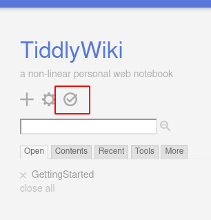

# tiddlyd2

## Overview

Converts individual markdown files and directories of markdown files into a TiddlyWiki file. The goal is to support multiple systems for creating markdown files (Obsidian, Dendron, Logseq, VS Code, Geany, Emacs, Vim, etc.) The TiddlyWiki file can be opened directly in a browser, without a running web server, and you'll have all the power of tags, backlinks, filters, search, and so on provided by TiddlyWiki.

## Motivation

An example to motivate this project:

```
tiddlyutils --tasks ~/taskdir --single ~/foo.html --single ~/bar.md
```

This creates a new TiddlyWiki file titled twsite.html holding three tiddlers. The first will be the open tasks from the 14 markdown files you created for some of your projects in directory `~/taskdir` using Emacs. The second tiddler will be a few tiddlers you created manually that you want included when you review your open tasks. The third tiddler will be a conversion of the contents of file `bar.md`. It's a markdown file you created in Obsidian with links to podcasts you're listening to each day as you eat lunch.

You open twsite.html in your browser and throughout the day you are able to review the things you have to do to stay on top of all of your active projects. At lunch time, you look at the podcast links to see which you're in the mood to listen to. At the end of the day, you review the remaining open tasks and decide your priorities for tomorrow.

This is helpful, but you realize you're looking at more than 100 open tasks every time you open your browser. You're burning through a lot of energy deciding which tasks are relevant and which aren't over and over again each day. There's no good reason to decide "Get Fluffy neutered" isn't relevant to your work at the office eight times a day. You can [specify a pattern](https://dlang.org/phobos/std_path.html#globMatch) to select the relevant files in `~/taskdir`. Since every file related to home ends with `- home.md` and every file related to work ends with `- work.md`, you can narrow the files you're pulling tasks from by appending a pattern to the directory name:

```
tiddlyutils --tasks '~/taskdir{*- work.md}' --single ~/foo.html --single ~/bar.md
```

Single quotes have been added to avoid problems caused by the space in the pattern. That's an improvement, but you're still seeing too much information in the task list. If you use David Allen's GTD method, you're thinking in terms of next actions (the ones you should be working on when you decide to work on that project), future actions (you need to work on them to complete the project, but you can't do them now), and someday/maybe actions (things you're considering doing for the project, but you haven't made a decision one way or the other). 

You have a tasks file that looks like this:

```
- [ ] Finish function bar for libfoo
- [ ] Finish function baz for libfoo
- [ ] Test libfoo
- [ ] Convert the entire codebase to libfoo if it's performant
```

There's no point seeing the last two tasks if the first two aren't done. You're definitely going to test the library, but you can't do that until you've written the last two functions, so that's a future task. The last one is conditional on information you don't currently have, so you can't decide if you're going to make a commitment to doing it. You add qualifiers (arbitrary text starting with `@` and not including newlines) to your tasks to facilitate a more fine-grained review:

```
- [ ] Finish function bar for libfoo @next
- [ ] Finish function baz for libfoo @next
- [ ] Test libfoo @future
- [ ] Convert the entire codebase to libfoo if it's performant @maybe
```

During work, you only want to see your next actions for work projects, so you modify the call to

```
tiddlyutils --tasks '~/taskdir@next{*- work.md}' --single ~/foo.html --single ~/bar.md
```

and you have a tiddler with only tasks qualified with `@next` in files that end with `- work.md`. When you're planning for the upcoming week on Sunday night, you want to view next actions and future tasks, so you use the call

```
tiddlyutils --tasks '~/taskdir@next@future@maybe{*- work.md}' --single ~/foo.html --single ~/bar.md
```

That gives you one tiddler with next actions for all work projects, another with future actions, and a third with someday/maybe items. Once you've reviewed all the tasks you've committed to doing, you can open up the someday/maybe items to see if you're ready to commit to doing or not doing some of them.

## All options

- `--tasks -t`: Compile all open tasks in the given directory into a tiddler. If multiple task qualifiers are provided, each gets its own tiddler.
- `--blocks -b`: Pull all tiddly blocks out of the files in the given directory. Each becomes its own tiddler, with frontmatter converted to attributes.
- `--filter -f`: Create a tiddler with links to all tiddlers that satisfy the given filter. Filter notation is that of TiddlyWiki.
- `--input -i`: The name of the TiddlyWiki input file to use as a template to add the created tiddlers. If not provided, it uses empty52.html in the current directory. Requires TiddlyWiki version 5.2 or later. Can be [downloaded at this link](https://tiddlywiki.com/#GettingStarted). Any valid TiddlyWiki file will work as long as it is version 5.2 or later. You can make changes by loading the file in your browser, customizing, and saving. (Do not use "Save As". That will not work.) You need to click this button:
	
	
	
- `--single -s`: The given filename will be treated as a file of tiddlers and inserted as is if it has extension html. If it has extension md, it will be converted to a tiddler.
- `--markdown -m`: Compile all of the markdown files in the given directory into individual tiddlers. The title is the name of the file after stripping the extension.
- `--path -p`: If provided, is added as the path to all single files. This is convenient when adding several individual files.
- `--output -o`: If provided, is the name of the output file, potentially with a full path. If not provided, creates twsite.html in the current directory.
- `--tiddlers`: If provided, is used as the name of the output file, but it only contains the tiddlers, not a full TiddlyWiki. Supports a workflow where the same tiddlers enter into multiple wikis, or where it's more convenient to construct one wiki in multiple parts. The output file is then included in a different wiki using option `--single` or `-s`.
- `--strip`: Not currently stable. Part of the server implementation.
- `--update`: Not currently stable. Part of the server implementation.

## Patterns

You can specify a pattern to use to narrow the files processed in a particular directory. You do that by appending the pattern to the end of the directory name inside `{}`. For instance, to limit processing to markdown files starting with z, you'd use `/path/to/dir{z*.md}`. Any patterns [described here](https://dlang.org/phobos/std_path.html#globMatch) are valid. Note that no escaping of `{` or `}` is necessary.

## Task qualifiers

You can specify one or more qualifiers to limit the tasks you query. A task qualifier is arbitrary text that starts with `@` and doesn't include newline characters. You specify one or more task qualifiers by appending them to the directory name, but prior to a pattern, if a pattern is provided. The specification `-t /home/fred/dir@foo@bar@baz{z*.md}` processes all open tasks in markdown files starting with z inside /home/fred/dir. On the other hand, the specification `-t /home/fred/dir@foo@bar@baz` does not include a pattern, so tasks will be pulled from all files in that directory.

Separate tiddlers are created for tasks qualified with @foo, @bar, and @baz. Since there can be multiple qualifiers applied to a given task, individual tasks may appear in more than one of the created tiddlers. 
